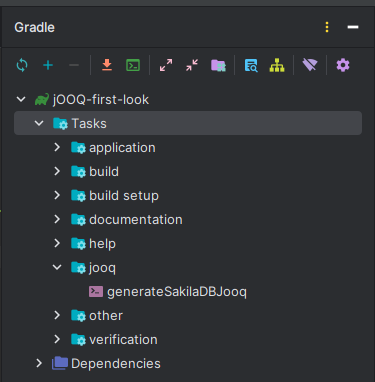

# 섹션 1-2. jOOQ 프로젝트 생성하기

## 프로젝트 주요 기술 버전
- java 17
- spring Boot 3.2.4
- jOOQ 3.19.5 
- gradle 8.5

## 환경설정하기
### Step 1. Spring Initializer로 Spring Boot 프로젝트 생성

```build.gradle```에 아래와 같이 디펜던시 추가

```
buildscript {
	ext {
		jooqVersion = '3.19.5'
	}
}

// ... 

dependencies {
    implementation 'org.springframework.boot:spring-boot-starter'
    
    // jOOQ 의존성 수동설정
    implementation ('org.springframework.boot:spring-boot-starter-jooq') {
        exclude group: 'org.jooq:jooq'
    }
    
    implementation "org.jooq:jooq:${jooqVersion}"
    runtimeOnly 'com.mysql:mysql-connector-j'
    testImplementation 'org.springframework.boot:spring-boot-starter-test'
}
```

### Step 2. nu.studer.jooq gradle plugin 추가

```
plugins {
    // ...
	id 'nu.studer.jooq' version '9.0'
}
```

### Step 3. jOOQ 설정

```
String dbUser   = System.properties["db-user"]   ?: "root"
String dbPasswd = System.properties["db-passwd"] ?: "passwd"

jooq {
	version = "${jooqVersion}"
	configurations {
		sakilaDB {
			generationTool {
			    
			    // DB 접속정보
				jdbc {
					driver = 'com.mysql.cj.jdbc.Driver'
					url = 'jdbc:mysql://localhost:3306'
					user = "${dbUser}"
					password = "${dbPasswd}"
				}
				
				
				generator {
					name = 'org.jooq.codegen.DefaultGenerator'

					database {
						name = 'org.jooq.meta.mysql.MySQLDatabase'

						schemata {
							schema {
								inputSchema = 'sakila'
							}
						}
					}
					
					generate {
						daos = true
						records = true
						immutablePojos = true
						fluentSetters = true
						javaTimeTypes = true
						deprecated = false
					}

					target {
						directory = 'src/generated'
					}
				}
			}
		}
	}
}
```

### Step 4. sourceSet에 src/generated 추가
```build.gradle```
```
sourceSets {
	main {
		java {
			srcDirs = ["src/main/java", "src/generated"]
		}
	}
}
```

### Step 5. jooq-codegen에 의존성 추가

```build.gradle```
```
dependencies {
    // ...
    jooqGenerator 'com.mysql:mysql-connector-j'
	jooqGenerator "org.jooq:jooq:${jooqVersion}"
	jooqGenerator "org.jooq:jooq-meta:${jooqVersion}"
}
```

### Step 6. generateSakilaDBJooq task 실행
