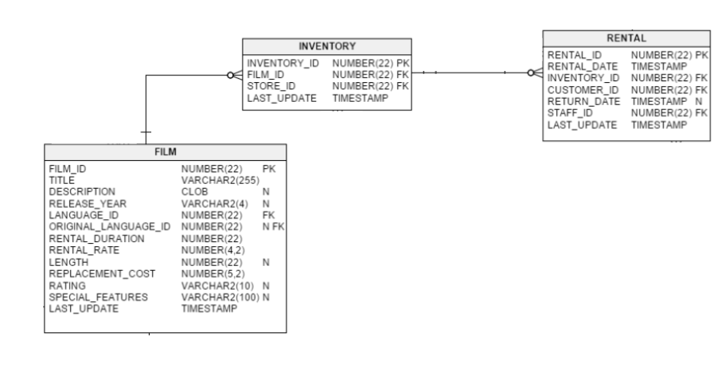

# 섹션 5-3. jOOQ에서 nested one-to-many 형태의 오브젝트 만들기 



### 1. 사용 쿼리

```mysql
SELECT `film`.`film_id`              as `nested.film_id`,
       `film`.`title`                as `nested.title`,
       `film`.`description`          as `nested.description`,
       `film`.`release_year`         as `nested.release_year`,
       `film`.`language_id`          as `nested.language_id`,
       `film`.`original_language_id` as `nested.original_language_id`,
       `film`.`rental_duration`      as `nested.rental_duration`,
       `film`.`rental_rate`          as `nested.rental_rate`,
       `film`.`length`               as `nested.length`,
       `film`.`replacement_cost`     as `nested.replacement_cost`,
       `film`.`rating`               as `nested.rating`,
       `film`.`special_features`     as `nested.special_features`,
       `film`.`last_update`          as `nested.last_update`,
       `inventory`.`inventory_id`    as `nested.inventory_id`,
       `inventory`.`film_id`         as `nested.film_id`,
       `inventory`.`store_id`        as `nested.store_id`,
       `inventory`.`last_update`     as `nested.last_update`,
       `rental`.`rental_id`          as `nested.rental_id`,
       `rental`.`rental_date`        as `nested.rental_date`,
       `rental`.`inventory_id`       as `nested.inventory_id`,
       `rental`.`customer_id`        as `nested.customer_id`,
       `rental`.`return_date`        as `nested.return_date`,
       `rental`.`staff_id`           as `nested.staff_id`,
       `rental`.`last_update`        as `nested.last_update`
FROM `film`
    LEFT JOIN `inventory` 
        on `film`.`film_id` = `inventory`.`film_id`
    LEFT JOIN `rental`
        on `inventory`.`inventory_id` = `rental`.`inventory_id`
```

### 2. SQL Row 정의
```java
// ...
import org.jooq.generated.tables.pojos.Film;
import org.jooq.generated.tables.pojos.Inventory;
import org.jooq.generated.tables.pojos.Rental;

@Getter
@RequiredArgsConstructor
public class FilmInventoryRental {
    private final Film film;
    private final Inventory inventory;
    private final Rental rental;
}
```

### 3. Nested OneToMany 클래스 생성

```java

// ...
import org.jooq.generated.tables.pojos.Film;
import org.jooq.generated.tables.pojos.Inventory;
import org.jooq.generated.tables.pojos.Rental;

@Getter
public class FilmInventorySummary {

    private final Film film;
    private final List<InventoryRental> inventoryList;

    public FilmInventorySummary(Map.Entry<Film, Map<Inventory, List<Rental>>> entry) {
        this.film = entry.getKey();
        this.inventoryList = entry.getValue().entrySet().stream()
                .map(InventoryRental::new)
                .toList();
    }

    public Long getFilmId() {
        return film.getFilmId();
    }

    @Getter
    public static class InventoryRental {
        private final Inventory inventory;
        private final List<Rental> rentalList;

        public InventoryRental(Map.Entry<Inventory, List<Rental>> entry) {
            this.inventory = entry.getKey();
            this.rentalList = entry.getValue();
        }
    }
}
```


### 4. filmRepository에 구현

```java
import lombok.RequiredArgsConstructor;
import org.jooq.DSLContext;
import org.jooq.generated.tables.*;
import org.jooq.generated.tables.pojos.Film;
import org.jooq.impl.DSL;
import org.springframework.stereotype.Repository;

import java.util.Comparator;
import java.util.List;
import java.util.stream.Collectors;

@Repository
@RequiredArgsConstructor
public class FilmRepository {
    public List<FilmInventorySummary> findNestedFilmInventorySummary() {
        final JFilm FILM = JFilm.FILM;

        final List<FilmInventoryRental> filmInventoryRentals = dslContext.select(
                        DSL.row(FILM.fields()),
                        DSL.row(FILM.inventory().fields()),
                        DSL.row(FILM.inventory().rental().fields())
                )
                .from(FILM)
                .leftJoin(FILM.inventory())
                .leftJoin(FILM.inventory().rental())
                .fetchInto(FilmInventoryRental.class);

        return filmInventoryRentals.stream()
                .collect(
                        Collectors.groupingBy(
                                FilmInventoryRental::getFilm,
                                Collectors.groupingBy(
                                        FilmInventoryRental::getInventory,
                                        Collectors.mapping(FilmInventoryRental::getRental, Collectors.toList())
                                )
                        )
                ).entrySet()
                .stream()
                .map(FilmInventorySummary::new)
                .sorted(Comparator.comparingLong(FilmInventorySummary::getFilmId))
                .toList();
    }

    public Long countOfAllFilm() {
        return dslContext.selectCount()
                .from(FILM)
                .fetchOneInto(Long.class);
    }
}
```

### 5. 테스트코드 검증
```java
@SpringBootTest
public class JooqNestedOneToManyTest {

    @Autowired
    FilmRepository filmRepository;

    @Test
    void nestedOneToMany() {
        List<FilmInventorySummary> nestedFilmInventorySummary = filmRepository.findNestedFilmInventorySummary();
        Long countOfAllFilm = filmRepository.countOfAllFilm();

        Assertions.assertThat(Long.valueOf(nestedFilmInventorySummary.size()))
                .isEqualTo(countOfAllFilm);
    }
}
```
